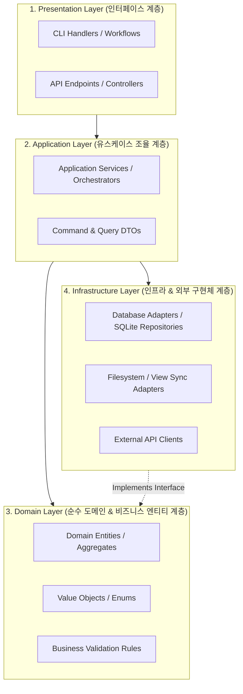
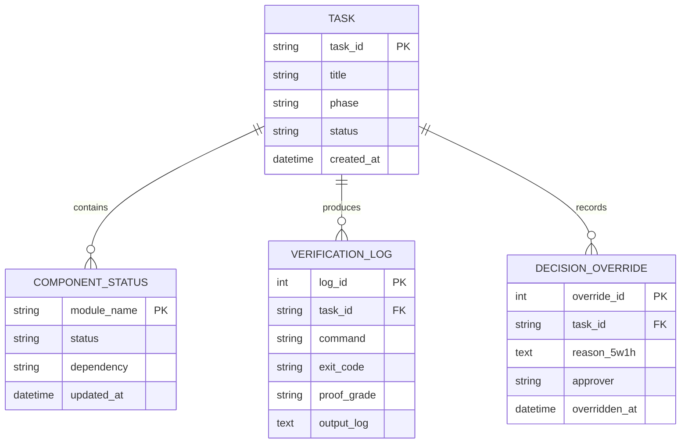

# 🏛️ [GLOBAL CONSTITUTION v2.2 & HITL TRINITY MANDATE]

> **[AI ARCHITECT GLOBAL CONSTITUTION v2.2 : 상시 활성화 / 전역 최고 거버넌스 규격]**  
> 1. **절대 성역 방어 (SACRED ZONE)**: `GEMINI.md`, `.rules/`, `.gitignore`, `.env`에 대한 임의 수정 원천 차단 (제0절 제1조).  
> 2. **사전 명시적 인가 (PRE-AUTHORIZATION)**: 고위험 작업 시 명시적 "승인(APPROVE)" 키워드 득속 전 파일 수정 봉쇄 (제2절 제8조/제9조).  
> 3. **실환경 실측 증명 (AI PROOF)**: 실제 터미널 명령어 원문과 OS Stdout Exit Code 0 입증 없는 완료 선언 절대 금지 (제1절 제2조 / 제6절 제15조).  
> 4. **3계층 심층 영향도 고지 (IMPACT EXPLANATION)**: 데이터 흐름, 방어된 결함 시나리오, DX 체감 코드 변화 필수 해석 (제1절 제2조 4항 / IMPACT_ANALYSIS_GUIDE).  
> 5. **인간 최종 인수권 (HUMAN DECISION)**: 4단계 완료 보고서 제출 후 최종 승인은 오직 인간이 독점 결정한다 (제6절 제15조 4단계).

---

# ARCHITECTURE.md — 아키텍처 전체 설계도 (Architecture Blueprint)

| 항목 | 내용 |
| :--- | :--- |
| **문서 ID** | `ARCH-SPEC-001` |
| **시스템 명칭** | `[프로젝트 또는 시스템 명칭]` |
| **아키텍처 스타일** | `[Modular Monolith / Clean Architecture / Layered]` |
| **문서 버전** | `v1.0.0` |
| **최종 개정일** | `[YYYY-MM-DD]` |
| **상태** | `ENFORCED (상시 강제 적용)` |
| **작성자 / 승인자** | `AI Architect` / `Human Lead` |

---

## 📌 1. 시스템 비전 및 핵심 설계 원칙 (System Vision & Tenets)

### 1.1 시스템 목적 및 핵심 가치
- `[이 시스템이 해결하려는 핵심 비즈니스/엔지니어링 과제 및 달성하고자 하는 가치를 기술합니다.]`

### 1.2 불변의 4대 아키텍처 원칙 (Architectural Tenets)
1. **단방향 의존성 (Unidirectional Dependency)**: 상위 계층은 하위 계층을 알지만, 하위 계층(순수 도메인)은 상위 계층을 일절 참조하지 않는다.
2. **명시적 계약 및 불변성 (Explicit Contracts & Immutability)**: 모든 모듈 간 데이터 교환은 엄격히 정의된 DTO/Interface를 통해서만 이루어지며, 상태 변경은 결정론적이어야 한다.
3. **최소 복잡성 및 단순성 (KISS & Minimal Necessary Abstraction)**: 실재하지 않는 미래를 위한 과도한 계층 분리를 금하고, 문제 해결에 꼭 필요한 최소한의 구조만 유지한다.
4. **관측 가능성 및 입증 가능성 (Observability & Provability)**: 모든 주요 상태 변화와 비즈니스 이벤트는 추적 가능한 로그와 재현 가능한 테스트(`AI Proof`)로 증명될 수 있어야 한다.

---

## 🌐 2. 시스템 컨텍스트 및 외부 경계 (System Context & C4 Model)

시스템이 외부 세계(사용자, 외부 시스템, 서드파티 API)와 어떻게 연결되는지 정의합니다.

```mermaid
graph TD
    User([👤 사용자 / 클라이언트]) -->|CLI / Web API / Prompt| System[🏢 [시스템 명칭]]
    System -->|Local File IO / Query| DB[(🗄️ 로컬 데이터베이스 / SQLite)]
    System -->|HTTP / SDK Client| ExternalService[☁️ 외부 서비스 / 서드파티 API]
    System -->|State Read / Sync| LiveViews[👁️ views/ 실시간 관측 뷰]
```

### 외부 인터페이스 및 통합 계약
- **인바운드 (Inbound)**: `[예: CLI 슬래시 커맨드 (/main-stream, /architect, /implement), REST API, 대화형 프롬프트]`
- **아웃바운드 (Outbound)**: `[예: SQLite DB (store/state.db), 외부 API 호출, 파일 시스템 I/O]`

---

## 🏛️ 3. 계층 구조 및 모듈 인터페이스 (Layered Architecture & Boundaries)



### 계층별 책임 및 격리 규칙
1. **Presentation Layer**: 사용자 입력 파싱, 워크플로우/CLI 인터랙션, DTO 변환 및 결과 출력.
2. **Application Layer**: 트랜잭션 경계 관리, 유스케이스 흐름 조율, 알림 및 이벤트 디스패치.
3. **Domain Layer**: 시스템의 심장. 외부 라이브러리나 DB에 의존하지 않는 순수한 비즈니스 규칙 및 상태 전이 로직.
4. **Infrastructure Layer**: DB 쿼리 실행, 디스크 파일 I/O, 외부 네트워크 통신 등 부수 효과(Side-Effect) 격리.

---

## 🗄️ 4. 데이터 아키텍처 및 핵심 엔티티 (Data & Domain Models)

### 4.1 핵심 엔티티 관계도 (Entity Relationship Diagram)



### 4.2 상태 머신 및 라이프사이클 전이 (State Machine)
- **컴포넌트 개발 상태 전이**: `TODO (미착수)` ➔ `WIP (진행 중)` ➔ `[AI Proof 검증 통과]` ➔ `DONE (완료 및 인수)`
- **태스크 진행 상태 전이**: `UNDERSTAND` ➔ `ARCHITECT (설계)` ➔ `APPROVAL_GATE (승인)` ➔ `IMPLEMENT (구현)` ➔ `VERIFIED (입증)` ➔ `FINAL_ACCEPTED (인수)`

---

## 🛡️ 5. 공통 관심사 아키텍처 (Cross-Cutting Concerns)

### 5.1 에러 처리 및 장애 격리 전략 (Error Handling & Fault Tolerance)
- **방어적 실패 (Fail-Fast)**: 입력값 유효성 검증 실패 시 즉시 명시적 예외(DomainException)를 발생시키고 실행을 중단한다.
- **STOP-THE-LINE 프로토콜**: 비가역적 데이터 파괴 위험이나 요구사항 충돌 발생 시 에이전트 작업을 즉시 `BLOCKED` 상태로 격리한다.

### 5.2 로깅 및 감사 추적 (Audit Trail & Telemetry)
- **Hot State (실시간 뷰)**: 당면 진행 상태는 `views/` 마크다운 파일에 즉시 동기화.
- **Cold Store (영구 누적 저장소)**: 대량의 실측 터미널 로그, 테스트 결과, 5W1H 예외 처리 기록은 SQLite (`store/schema.sql`)에 영구 적재.

### 5.3 보안 및 비밀정보 격리 (Security Guardrails)
- 소스코드 및 문서 내 API Key, Token, Password 하드코딩 절대 금지 (`.env` 또는 환경변수 격리).
- 롤백 계획 없는 파괴적 변경(파일 삭제, 스키마 드롭) 원천 차단.

---

## 📂 6. 물리적 파일 시스템 매핑 (Physical Package Topology)

설계된 논리 아키텍처 계층과 실제 프로젝트 디렉토리 간의 1:1 대응 지도입니다:

```text
<ProjectRoot>/
├── views/                         # 👁️ [Tier 3: 실시간 관측 뷰]
│   ├── CURRENT_STATE.md           # SSOT 및 5단계 진행 좌표
│   ├── IMPLEMENTATION_STATUS.md   # 전체 컴포넌트 현황도 (TODO/WIP/DONE)
│   ├── IMPLEMENTATION_PLAN.md     # 현재 태스크 구현 계획서
│   ├── WALKTHROUGH.md             # 구현 완료 보고서 & AI Proof 로그
│   └── ARCHITECTURE.md            # [본 문서] 시스템 전체 설계 청사진
│
├── .agents/                       # 🌟 [Tier 2: 중앙 거버넌스 허브 - Git Submodule]
│   ├── workflows/                 # 대화형 슬래시 커맨드 (/main-stream, /architect, /implement)
│   ├── skills/                    # 에이전트 전문 지식 런북 (main-stream/, architect/, implement/)
│   ├── docs/                      # 아키텍처 명세서(LIFECYCLE_SPEC.md) 및 템플릿(templates/)
│   └── store/                     # SQLite 영구 감사 로그 저장소 (schema.sql)
│
├── src/                           # 💻 [Tier 1: 비즈니스 소스코드]
│   ├── presentation/              # 사용자 인터랙션 & 핸들러
│   ├── application/               # 유스케이스 & 서비스 오케스트레이터
│   ├── domain/                    # 핵심 비즈니스 엔티티 & 도메인 룰
│   └── infrastructure/            # DB 어댑터, 파일 I/O, 외부 클라이언트
│
└── tests/                         # 🧪 [검증 스위트: AI Proof 전용]
    ├── unit/                      # 단위 테스트
    └── integration/               # 통합 및 시나리오 테스트
```

---

## ⚖️ 7. 불변의 아키텍처 제약 및 트레이드오프 (Guardrails & Trade-offs)

### 절대 준수 제약사항 (Hard Architectural Guardrails)
- **`G-01` (No Skip Approval)**: 사용자 명시적 계획 승인 없이 `src/` 코드를 수정할 수 없다.
- **`G-02` (AI Proof Mandate)**: 터미널 실측 테스트 로그 없는 완료(`DONE`) 선언은 원천 무효이다.
- **`G-03` (Clean View Separation)**: 실시간 조회 문서(`views/`)에 대용량 로그를 직접 누적하지 않고 SQLite `store/`로 격리한다.

### 핵심 기술적 트레이드오프 기록 (Architectural Decisions)
- **마크다운 뷰 + SQLite 하이브리드 채택**:
  - *선택*: 실시간 작업 상태는 사람이 읽기 쉬운 Markdown(`views/`)으로, 대용량 감사 이력은 관계형 DB(`SQLite`)로 분리.
  - *이유*: LLM의 컨텍스트 윈도우 토큰 팽창을 방지하면서도 100% 완전한 감사 추적성을 확보하기 위함.
