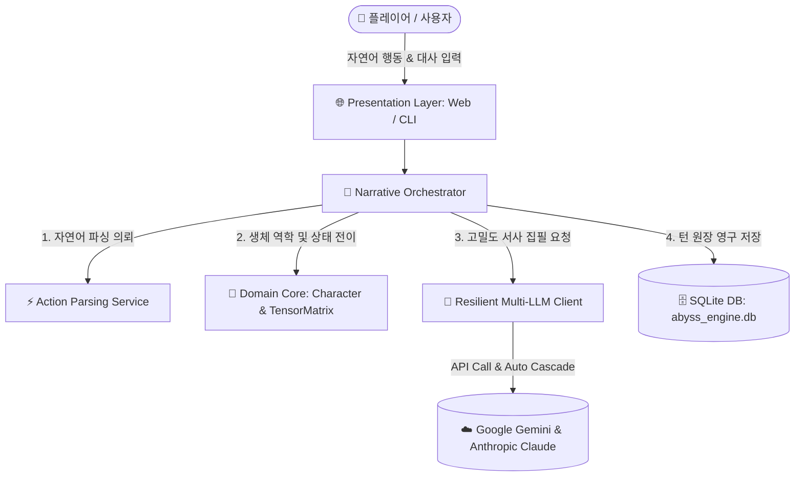
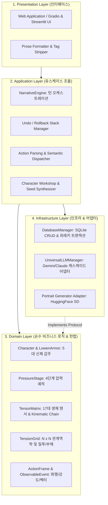
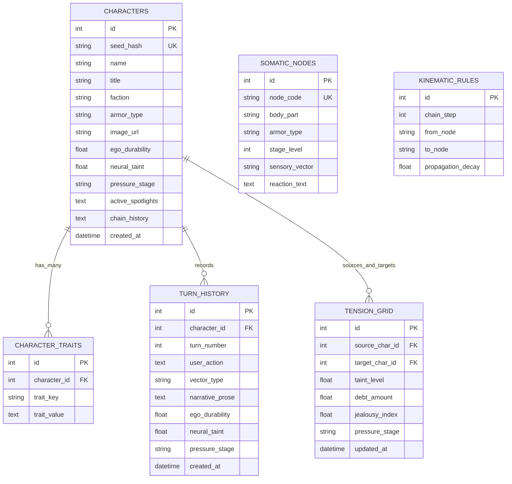

# ARCHITECTURE.md — 아키텍처 전체 설계도 (Architecture Blueprint)

| 항목 | 내용 |
| :--- | :--- |
| **문서 ID** | `ARCH-SPEC-001` |
| **시스템 명칭** | `AbyssEngine` (심연의 제국: 생체 역학 및 인터랙티브 서사 롤플레이 엔진) |
| **아키텍처 스타일** | `Clean Layered Architecture (DDD 4-Tier + Resilient Multi-LLM Adapter)` |
| **문서 버전** | `v2.1.0 (Reverse-Engineered Specification)` |
| **최종 개정일** | `2026-09-02` |
| **상태** | `REVIEW_REQUIRED (사용자 사전 승인 대기)` |
| **작성자 / 승인자** | `AI Architect` / `Human Lead` |

---

## 📌 1. 시스템 비전 및 핵심 설계 원칙 (System Vision & Tenets)

### 1.1 시스템 목적 및 핵심 가치
- **비전**: 대규모 언어 모델(Gemini / Claude)의 문학적 서사 생성 능력과, 100% 결정론적인 **순수 파이썬 생체 역학(Somatic Tensor) 및 로웬 신체 갑주(Lowen Character Armor) 물리 엔진**을 결합하여, 환각 없는 수치 인과율과 고밀도 몰입감을 제공하는 인터랙티브 텍스트 롤플레이 시뮬레이션 시스템.

### 1.2 불변의 4대 아키텍처 원칙 (Architectural Tenets)
1. **결정론적 상태 인과율 (Deterministic State Computation)**:
   - 자아 내구도, 신경 오염도, 17대 생체 텐서, 운동 연쇄(Kinematic Chain) 전이 연산은 LLM의 확률에 맡기지 않고 **100% 순수 파이썬 네이티브 도메인 로직(0토큰, 0ms, 무오차)**으로 연산한다.
2. **탄력적 멀티 LLM 캐스케이드 (Resilient Multi-Provider Fallback)**:
   - LLM 호출 실패, Quota Exceeded (429), 타임아웃 발생 시 Gemini ➔ Claude 간 크로스 프로바이더 자동 스왑을 통해 서사 생성이 중단되지 않는 고가용성을 보장한다.
3. **단방향 의존성 및 순수 도메인 격리 (Strict Clean Domain Isolation)**:
   - 도메인 계층(Character, TensorMatrix, LowenArmor, ActionFrame)은 DB나 LLM API 등 외부 인프라 라이브러리를 일절 참조하지 않는 순수 POPO(Plain Old Python Object)로 격리한다.
4. **완벽한 불변 스냅샷 롤백 (Turn Snapshot & Undo Capability)**:
   - 매 턴의 상태와 서사는 불변 스냅샷(`TurnSnapshot`)으로 스택에 보존되어, 언제든 직전 턴으로 100% 오차 없이 롤백(Undo)될 수 있어야 한다.

---

## 🌐 2. 시스템 컨텍스트 및 외부 경계 (System Context)



---

## 🏛️ 3. 4계층 모듈 구조 및 경계 정의 (Layered Architecture)



---

## 🗄️ 4. 데이터 아키텍처 및 핵심 엔티티 (Data & Domain Models)

### 4.1 RDB 엔티티 관계도 (Entity Relationship Diagram)



---

## 📂 5. 신규 `src/` 물리 디렉토리 재구축 매핑 (Package Topology)

거대 모놀리스(`web_app.py 249KB`, `narrative_engine.py 53KB`)를 결함 없이 점진적으로 재구축할 대상 디렉토리 구조입니다:

```text
src/
├── presentation/                  # 🌐 프레젠테이션 계층
│   ├── web/                       # 웹 UI 컴포넌트 및 라우터
│   └── prose_sanitizer.py         # 서사 대사 분리 및 시스템 태그 소멸 정제기
│
├── application/                   # 🧠 유스케이스 계층
│   ├── narrative_orchestrator.py  # 턴 라이프사이클 오케스트레이터
│   ├── undo_manager.py            # TurnSnapshot 기반 롤백 스택
│   ├── action_parser_service.py   # 자연어 지문/대사 분할 및 화행 분석 서비스
│   └── character_service.py       # 캐릭터 생성/조회 및 시드 생성기
│
├── domain/                        # 🧬 순수 도메인 계층 (외부 의존성 제로)
│   ├── character.py               # Character 엔티티 및 LowenArmor
│   ├── pressure_stage.py          # 4단계 압력 궤적 상태 머신
│   ├── tensor_matrix.py           # 17대 생체 텐서 & Kinematic Chain 전이 엔진
│   ├── relational_vector.py       # 5대 관계역학 상성 벡터
│   ├── tension_grid.py            # N x N 관계역학 매트릭스
│   └── action_frame.py            # ActionFrame & ObservableEvent 모델
│
└── infrastructure/                # 🔌 인프라 계층
    ├── database/                  # SQLite 데이터베이스 어댑터
    │   ├── db_manager.py          # 트랜잭션 매니저
    │   └── repositories.py        # Character, TurnHistory, TensionGrid 리포지토리
    ├── llm/                       # 멀티 LLM 어댑터
    │   ├── universal_llm.py       # Gemini / Claude 캐스케이드 클라이언트
    │   └── prompt_builder.py      # Somatic Prose 및 서사 프롬프트 빌더
    └── media/                     # 초상화 생성 어댑터
        └── portrait_client.py     # HuggingFace SD 초상화 생성 클라이언트
```

---

## ⚖️ 6. 불변의 아키텍처 제약 조건 (Hard Guardrails)

- **`G-01` (Deterministic Somatics)**: 모든 텐서 수치 변경 및 신체 운동 연쇄는 `domain/tensor_matrix.py`에서 파이썬 코드로만 연산하며 LLM의 임의 출력을 신뢰하지 않는다.
- **`G-02` (Pure Domain)**: `src/domain/` 내부의 모듈은 `sqlite3`, `urllib`, `requests` 등 외부 I/O 패키지를 임포트할 수 없다.
- **`G-03` (Prose Sanitization)**: 플레이어에게 노출되는 최종 문학 서사에는 `[SOM_...]`, `[STATUS]` 등의 시스템 태그나 스탯 단어가 100% 제거되어야 한다.
