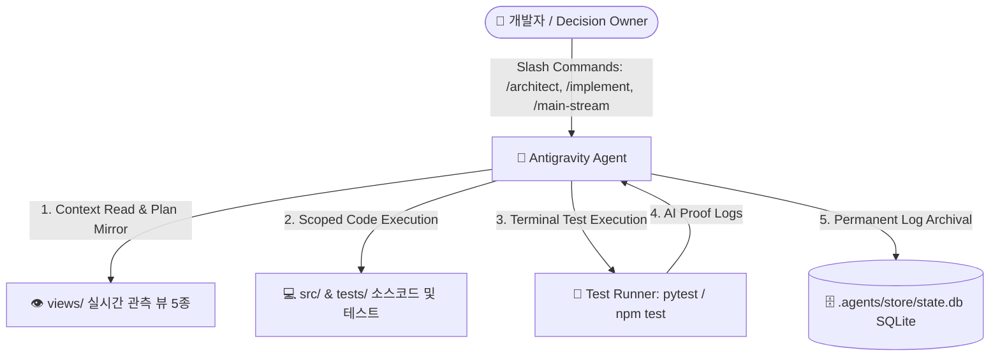
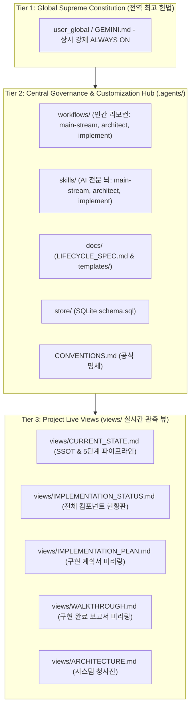
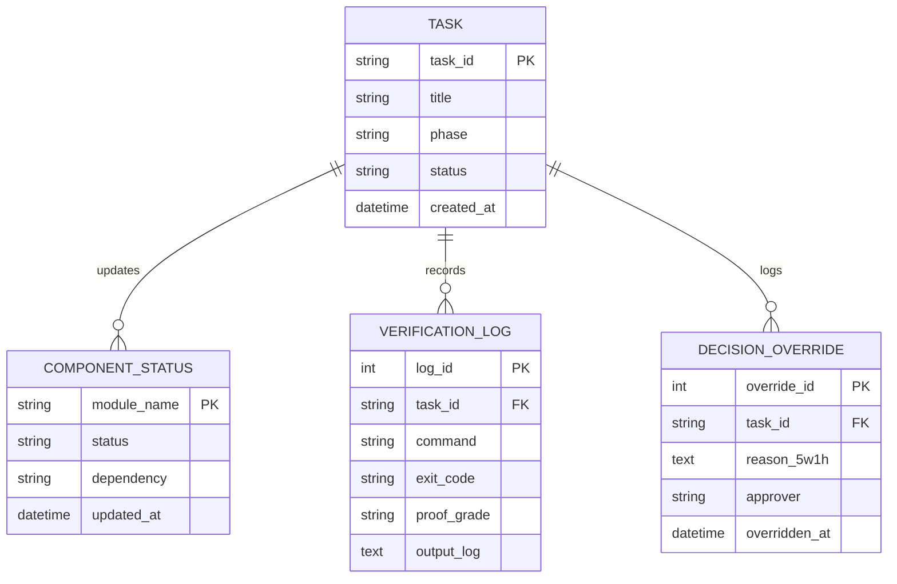

# ARCHITECTURE.md — 아키텍처 전체 설계도 (Architecture Blueprint)

| 항목 | 내용 |
| :--- | :--- |
| **문서 ID** | `ARCH-SPEC-001` |
| **시스템 명칭** | `AbyssEmpire-python-narrative` (Antigravity Governance Infrastructure) |
| **아키텍처 스타일** | `Two-Tier Hybrid Architecture (Live Views + Relational Store + Customization Hub)` |
| **문서 버전** | `v2.0.0` |
| **최종 개정일** | `2026-09-02` |
| **상태** | `ENFORCED (상시 강제 적용)` |
| **작성자 / 승인자** | `AI Architect` / `Human Lead` |

---

## 📌 1. 시스템 비전 및 핵심 설계 원칙 (System Vision & Tenets)

### 1.1 시스템 목적 및 핵심 가치
- **비전**: Google Antigravity 에이전트 환경에서 인간과 AI가 1:1 페어 프로그래밍을 수행할 때, AI의 독단적 자의적 판단, 미검증 조기 완료(Fake Completion), 환각을 원천 차단하고 고신뢰도 소프트웨어를 기민하게 생산하는 전역 거버넌스 및 워크플로우 인프라를 제공한다.

### 1.2 불변의 4대 아키텍처 원칙 (Architectural Tenets)
1. **인간 최종 결정권 및 무권대리 금지 (Human Authority & Anti-Compromise)**: AI는 입증책임자(Evidence Bearer)이자 공동 창조자이며, 아키텍처 승인 및 최종 인수는 인간(Human Lead)이 독점한다.
2. **Two-Tier 상태 분리 원칙 (Hot Views vs Cold Store)**: 실시간 작업에 필요한 닻(Anchor)은 `views/` 마크다운으로 가볍게 유지하고, 대용량 감사/테스트 로그는 SQLite(`store/`)로 격리하여 컨텍스트 토큰 낭비를 방지한다.
3. **1:1 대칭 모듈화 원칙 (Symmetric Workflow & Skill Topology)**: 인간이 지휘하는 슬래시 커맨드(`workflows/`)와 AI의 자율 런북(`skills/`)을 `main-stream`, `architect`, `implement`로 1:1 완벽하게 대칭시킨다.
4. **객관적 사실 기반 실측 검증 (AI Proof Mandate)**: 모든 변경은 실제 터미널 테스트 명령어(`run_command`)를 통한 `PROVEN` 원문 로그로만 완료를 입증한다.

---

## 🌐 2. 시스템 컨텍스트 및 외부 경계 (System Context)



---

## 🏛️ 3. 계층 구조 및 모듈 인터페이스 (Layered Architecture & Boundaries)



---

## 🗄️ 4. 데이터 아키텍처 및 핵심 엔티티 (Data & Domain Models)

### 4.1 핵심 엔티티 관계도 (Entity Relationship Diagram)



---

## 🛡️ 5. 공통 관심사 아키텍처 (Cross-Cutting Concerns)

1. **자동 미러링 프로토콜 (Brain-to-Views Auto-Mirroring)**:
   - Phase 1 (Architect): 브레인 `implementation_plan.md` ➔ `views/IMPLEMENTATION_PLAN.md` 자동 복사.
   - Phase 2 (Implement): 브레인 `walkthrough.md` ➔ `views/WALKTHROUGH.md` 자동 복사.
2. **장애 격리 (STOP-THE-LINE)**:
   - 요구사항 모호, 데이터 파괴 위험 감지 시 즉시 상태를 `BLOCKED`로 격리하고 사용자 유권해석 요청.
3. **이중 저장소 형상 관리**:
   - 중앙 코어(`Antigravity-Common-Core`)는 `.agents/` 서브모듈로 독립 버전 관리, 프로젝트는 상위 레포로 격리.

---

## 📂 6. 물리적 파일 시스템 매핑 (Physical Package Topology)

```text
my-project/ (AbyssEmpire-python-narrative)
├── README.md                      # 프로젝트 총괄 설명서
│
├── views/                         # 👁️ [Tier 3: 실시간 관측 뷰 5종]
│   ├── CURRENT_STATE.md           # [Core 1] 현재 상황 (SSOT & 파이프라인)
│   ├── IMPLEMENTATION_STATUS.md   # [Core 2] 구현 상황도 (컴포넌트 완성도)
│   ├── IMPLEMENTATION_PLAN.md     # [Core 3] 구현 계획서 (브레인 미러링)
│   ├── WALKTHROUGH.md             # [Core 4] 구현 완료 보고서 (브레인 미러링)
│   └── ARCHITECTURE.md            # [Core 5] 아키텍처 전체 설계도 (본 문서)
│
├── .agents/                       # 🌟 [Tier 2: 중앙 거버넌스 허브 Submodule]
│   ├── workflows/                 # 🎮 main-stream.md, architect.md, implement.md
│   ├── skills/                    # 🤖 main-stream/, architect/, implement/
│   ├── docs/                      # 📄 LIFECYCLE_SPEC.md & templates/
│   ├── CONVENTIONS.md             # 📜 공식 명세서
│   ├── GEMINI.md.example          # 🏛️ 전역 헌법 규격 예시
│   └── store/                     # 🗄️ SQLite schema.sql
│
├── src/                           # 💻 비즈니스 로직 소스코드
└── tests/                         # 🧪 단위/통합 테스트 스위트
```

---

## ⚖️ 7. 불변의 아키텍처 제약 조건 (Hard Guardrails)

- **`G-01` (Default Deny)**: 명시적 승인 없는 `src/` 코드 변경 전면 금지.
- **`G-02` (AI Proof Mandate)**: 미실행 테스트의 임의 완료 선언(`DONE`) 금지.
- **`G-03` (No Lazy Truncation)**: 코드/문서 생성 시 `// 기존 코드와 동일` 등 임의 생략 절대 금지.
